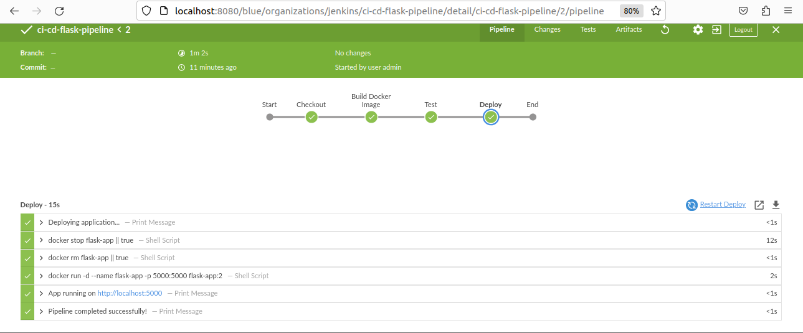

# CI/CD Pipeline with Jenkins & Docker 🚀

## Overview
Automated CI/CD pipeline that builds, tests, and deploys
a Python Flask application using Jenkins and Docker.

## Architecture
GitHub → Jenkins → Docker Build → Test → Deploy

## Tech Stack
- **Jenkins** — CI/CD Automation
- **Docker** — Containerization
- **Python Flask** — Web Application
- **GitHub** — Source Control

## Pipeline Stages
1. Checkout code from GitHub
2. Build Docker image
3. Run automated tests
4. Deploy container

## How to Run

Clone the repo
git clone https://github.com/AsmaSlimanii/ci-cd-jenkins-docker-pipeline.git

Start all services
docker-compose up -d

Access the app : http://localhost:5000
Access Jenkins : http://localhost:8080

## Project Structure
app/
  app.py
  requirements.txt
Dockerfile
Jenkinsfile
docker-compose.yml
README.md

## Author
Asma Slimani — Junior DevOps Engineer
LinkedIn : https://www.linkedin.com/in/asma-slimani-4a732a296/
GitHub : https://github.com/AsmaSlimanii
## Pipeline Screenshot

